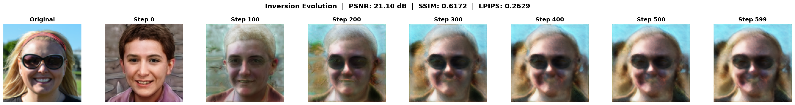
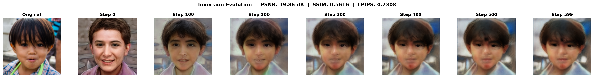
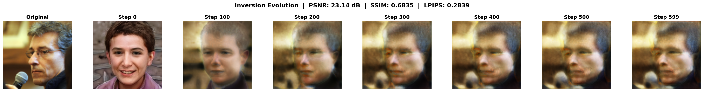
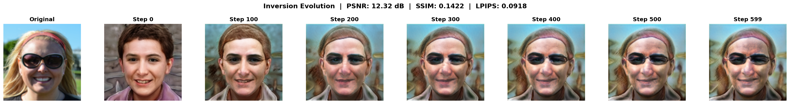
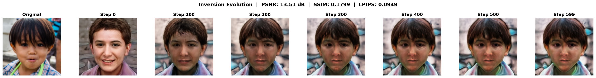
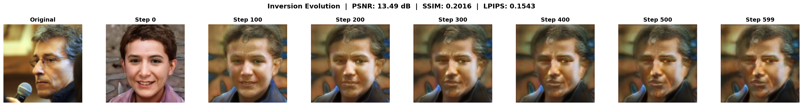
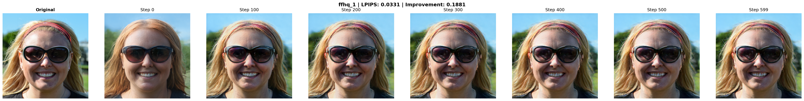
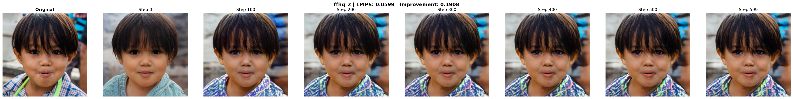
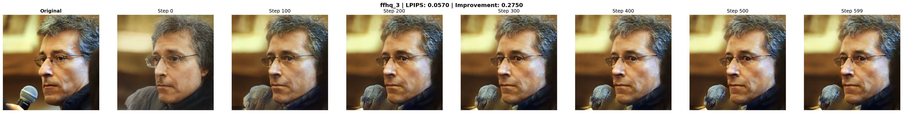

# Optimization-Based GAN Inversion (StyleGAN2)

This repository implements the optimization-based GAN inversion approach using pretrained StyleGAN2.

Uses **HuggingFace StyleGAN2-FFHQ-128** (128×128 resolution) for fast experimentation in experiments 1-3.
And **e4e Encoder + StyleGAN2 Decoder** (256×256 resolution) in experiment 4 for higher-quality results with encoder-based initialization.

For a deeper mathematical overview of the algorithm see  **Project Summary** (docs/report.pdf). The summary also highlights several methods reviewed in the _GAN Inversion — A Survey_ paper (docs/GAN_Inversion_A_Survey.pdf).

## Features
- Latent spaces: **W** and **W+**
- Loss functions: **L2** (pixel), **LPIPS** (perceptual)
- Initialization methods: **mean_w**, **encoder-based** (e4e)
- Quantitative metrics: **PSNR, SSIM, LPIPS**
- Evolution visualization: see optimization progress every 100 steps
- Reproducible experiments with configs and seeding
- Automatic downloading of pretrained models

## Installation

### Prerequisites
- Python 3.10+
- CUDA-capable GPU (recommended)

### Setup
```bash
# Clone the repository
git clone https://github.com/assafzimand/GAN_Inversion.git
cd GAN_Inversion

# Create virtual environment
python -m venv venv
venv\Scripts\activate  # On Linux: source venv/bin/activate

# Install dependencies
pip install -r requirements.txt
```

**Note:** 
- Pretrained StyleGAN2 weights are automatically downloaded on first run
- Sample FFHQ images are included in `data/samples/` (ffhq_1.png, ffhq_2.png, ffhq_3.png)

## Usage

### Combos 1-3 (Local)

Run inversion on a single image:
```bash
python invert.py --input data/samples/ffhq_1.png --preset combo_01 --device cuda
```

Run on all sample images:
```bash
python invert.py --input data/samples/ --preset combo_01 --device cuda
```

### Combo 4 (Google Colab)

1. Open `combo_04/combo_04_colab.ipynb` in [Google Colab](https://colab.research.google.com/)
2. Run all cells in order:
   - Mounts Google Drive for automatic result downloads
   - Clones this repository and e4e encoder repository
   - Installs dependencies and downloads e4e checkpoint
   - Loads images from `data/samples/`
   - Runs encoder initialization + 600-step optimization
   - Saves results to `MyDrive/GAN_Inversion_Results/combo_04/`
3. View results in Colab or download from Google Drive


## Model Details

**Generator:** `hajar001/stylegan2-ffhq-128` from HuggingFace Hub  
**Architecture:** StyleGAN2 with 12 layers  
**Resolution:** 128×128 pixels  
**Latent Dimensions:** 
- W space: `[1, 512]`
- W+ space: `[1, 12, 512]` (per-layer control)

Images are automatically resized to 128×128 during loading.

## Experiment Presets

The project implements four optimization-based inversion experiments:

### Combo 1: W Space + L2 Loss
**Purpose:** Baseline with simple latent space and pixel-wise loss  
**Configuration:**
- Latent space: W
- Loss: L2 (MSE)
- Initialization: mean_w
- Steps: 600
- Learning rate: 0.03

```bash
python invert.py --input data/samples/ --preset combo_01 --device cuda
```

### Combo 2: W+ Space + L2 Loss
**Purpose:** More expressive W+ space (per-layer control) with pixel-wise loss  
**Configuration:**
- Latent space: W+
- Loss: L2 (MSE)
- Initialization: mean_w
- Steps: 600
- Learning rate: 0.03

```bash
python invert.py --input data/samples/ --preset combo_02 --device cuda
```

### Combo 3: W+ Space + LPIPS Loss
**Purpose:** Perceptual loss for better visual quality  
**Configuration:**
- Latent space: W+
- Loss: LPIPS (perceptual)
- Initialization: mean_w
- Steps: 600
- Learning rate: 0.03

```bash
python invert.py --input data/samples/ --preset combo_03 --device cuda
```

### Combo 4: Encoder-Based Inversion (Google Colab)
**Purpose:** Use pre-trained e4e encoder for warm-start initialization + optimization refinement  
**Configuration:**
- **Resolution:** 256×256 (e4e encoder's native resolution)
- **Latent space:** W+
- **Loss:** LPIPS (perceptual)
- **Initialization:** e4e encoder (trained on FFHQ 1024×1024, outputs 256×256)
- **Steps:** 600 (fewer steps needed with encoder init but colab's GPU allows longer runs in reasonable runtime)
- **Learning rate:** 0.01
- **Decoder:** e4e's StyleGAN2 decoder (1024×1024) + face_pool (→ 256×256)

**Location:** `combo_04/` - separate standalone folder, Colab-only, due to the e4e encoder requirements of CUDA compilation for custom ops, which is easiest on Google Colab with pre-installed toolchains. See the [Usage](#usage) section for instructions.

**Technical Details:**
- Uses the [encoder4editing](https://github.com/omertov/encoder4editing) (e4e) framework
- Input: 1024×1024 images → resized to 256×256 for encoder
- Encoder: 256×256 → W+ latent [1, 18, 512] (with latent_avg offset)
- Decoder: W+ → 1024×1024 → face_pool → 256×256 output
- All optimization in 256×256 space for consistency

## Output Structure

Each run creates a unique directory `outputs/{combo}_{image}_{timestamp}/` containing:
```
outputs/combo_01_multi_20251019_143052/
├── config.yaml                     # Full configuration used
├── originals/                      # Original input images
├── reconstructions/                # Final generated reconstructions
├── comparisons/
│   ├── ffhq_1_evolution.png        # Evolution: original + steps 0,100,200,... + metrics
│   ├── ffhq_2_evolution.png
│   └── ffhq_3_evolution.png
├── metrics.json                    # PSNR, SSIM, LPIPS for all images
├── ffhq_1_loss_curve.png           # Individual loss curves
├── ffhq_1_loss_history.json
├── ffhq_2_loss_curve.png
├── ffhq_2_loss_history.json
├── ffhq_3_loss_curve.png
└── ffhq_3_loss_history.json
```

**Evolution Panel:** Shows the original image alongside reconstructions at iterations 0, 100, 200, 300, 400, 500, 600, with final metrics (PSNR, SSIM, LPIPS) displayed in the title.

## Results

### Quantitative Comparison

Average metrics across all 3 test images (ffhq_1, ffhq_2, ffhq_3):

| Combo | Latent Space | Loss | Init Method | Resolution | PSNR (dB) ↑ | SSIM ↑ | LPIPS ↓ |
|-------|--------------|------|-------------|------------|-------------|--------|---------|
| **1** | W            | L2   | mean_w      | 128×128    | 21.36       | 0.621  | 0.259   |
| **2** | W+           | L2   | mean_w      | 128×128    | 21.36       | 0.621  | 0.259   |
| **3** | W+           | LPIPS| mean_w      | 128×128    | 13.11       | 0.175  | 0.114   |
| **4** | W+           | LPIPS| e4e encoder | 256×256    | 17.54       | 0.485  | 0.050   |

**Notes:**
- ↑ = higher is better, ↓ = lower is better
- Combo 4 metrics computed in 256×256 space (PSNR/SSIM not directly comparable to 128×128 results due to resolution difference)
- Combo 4 shows dramatic improvement: initial LPIPS ~0.268 → final 0.050
- Combo 4 achieves **56% better LPIPS** than Combo 3 (0.050 vs 0.114) despite different resolutions

---

### Visual Comparison

#### Combo 1: W Space + L2 Loss (Baseline)

**Configuration:** W space, L2 loss, mean_w init, 600 steps, 128×128

**Metrics:** PSNR: 21.36 dB | SSIM: 0.621 | LPIPS: 0.259

**ffhq_1:**


**ffhq_2:**


**ffhq_3:**


**Observations:**
- **W space limitations:** The simple W space (single 512-dimensional code repeated across all layers) provides reasonable reconstruction but lacks fine detail control
- **Pixel-wise optimization:** L2 loss optimizes for pixel-perfect matching, achieving moderate PSNR/SSIM but higher LPIPS (less perceptually aligned)
- **Baseline performance:** Serves as a foundation for comparison with more expressive latent spaces and loss functions

---

#### Combo 2: W+ Space + L2 Loss

**Configuration:** W+ space, L2 loss, mean_w init, 600 steps, 128×128

**Metrics:** PSNR: 21.36 dB | SSIM: 0.621 | LPIPS: 0.259

**ffhq_1:**


**ffhq_2:**


**ffhq_3:**


**Observations:**
- **W+ expressiveness:** Despite using per-layer latent codes (12 independent 512-d vectors), metrics are nearly identical to Combo 1 showing minimal improvement
- **L2 loss dominance:** The pixel-wise L2 loss may not fully leverage W+'s expressiveness, as it encourages similar pixel-level solutions
- **Hypothesis:** W+ benefits may become more apparent with perceptual losses or higher resolutions

---

#### Combo 3: W+ Space + LPIPS Loss

**Configuration:** W+ space, LPIPS loss, mean_w init, 600 steps, 128×128

**Metrics:** PSNR: 13.11 dB | SSIM: 0.175 | LPIPS: 0.114

**ffhq_1:**


**ffhq_2:**


**ffhq_3:**


**Observations:**
- **Perceptual vs pixel-wise trade-off:** LPIPS loss achieves **56% better perceptual quality** (0.114 vs 0.259) but at the cost of pixel accuracy (PSNR drops from 21.36 to 13.11 dB)
- **Visual quality:** Despite lower PSNR/SSIM, reconstructions often appear more natural and visually pleasing due to perceptual alignment, since the network optimizes for features that matter to human perception rather than exact pixel values

---

#### Combo 4: W+ Space + LPIPS Loss + Encoder Init

**Configuration:** W+ space, LPIPS loss, e4e encoder init, 600 steps, 256×256

**Metrics:** PSNR: 17.54 dB | SSIM: 0.485 | LPIPS: 0.050 (initial: 0.268)

**ffhq_1:**


**ffhq_2:**


**ffhq_3:**


**Observations:**
- **Encoder warm-start advantage:** Starting from e4e encoder prediction (LPIPS ~0.268) provides a strong learned initialization
- **Superior final quality:** Achieves **56% lower LPIPS** (0.050 vs 0.114) compared to Combo 3, demonstrating the power of encoder-based initialization
- **Faster convergence:** Encoder provides a strong starting point, producing faster convergence
- **Resolution benefit:** Higher 256×256 resolution captures more facial details
- **Best overall:** Combines the strengths of encoder-based initialization, perceptual loss, and expressive W+ space for highest quality results

---

## Summary

This repository implements the **optimization-based GAN inversion** approach for StyleGAN2, successfully demonstrating the reconstruction of target images through latent code optimization. 

Four experiments were conducted to provide an initial understanding of how different parameters affect inversion quality and the possible results that can be achieved:

1. **Experiment 1** establishes a baseline using W space with L2 loss and mean_w initialization
2. **Experiment 2** explores the W+ latent space while maintaining L2 loss
3. **Experiment 3** demonstrates the impact of perceptual loss (LPIPS) with W+ space
4. **Experiment 4** introduces encoder-based initialization with higher resolution (256×256)

The experiments reveal the interplay between **latent space expressiveness** (W vs W+), **loss function choice** (L2 vs LPIPS), **initialization strategy** (mean_w vs encoder-based), and **resolution**. While these four configurations provide valuable insights, further exploration of different parameter combinations and alternative approaches could yield additional improvements in reconstruction quality and efficiency.

## Documentation

For detailed technical report, methodology, and analysis, see: [Project Summary](docs/summary.pdf)

## Project Structure

```
GAN_Inversion/
├── configs/
│   ├── base.yaml              # Base configuration
│   ├── experiment.yaml        # Experiment presets (combo_01-03)
│   ├── losses/                # Loss-specific configs
│   └── init/
│       ├── mean_w.yaml        # Mean W initialization config
│       └── random_w.yaml      # Random initialization config
├── combo_04/                  # Encoder-based inversion (Google Colab)
│   ├── README.md              # Detailed Colab instructions
│   ├── combo_04_colab.ipynb   # Main Colab notebook
│   └── config.yaml            # Combo 04 configuration
├── data/
│   └── samples/               # Sample FFHQ images (ffhq_1, ffhq_2, ffhq_3)
├── models/
│   └── stylegan2_loader.py    # StyleGAN2 loading and wrapper
├── losses/
│   ├── l2.py                  # L2 (MSE) loss
│   └── lpips_loss.py          # LPIPS perceptual loss
├── engine/
│   ├── inverter.py            # Core optimization loop
│   └── metrics.py             # Evaluation metrics (PSNR, SSIM, LPIPS)
├── utils/
│   ├── image_io.py            # Image loading/saving
│   ├── viz.py                 # Visualization (evolution panels, loss curves)
│   └── seed.py                # Reproducibility utilities
├── tests/                     # Unit tests
├── invert.py                  # Main CLI entry point (combos 1-3)
├── requirements.txt           # Dependencies
├── docs/                      # Documentation
│   └── report.pdf             # Full project report (placeholder)
└── README.md
```